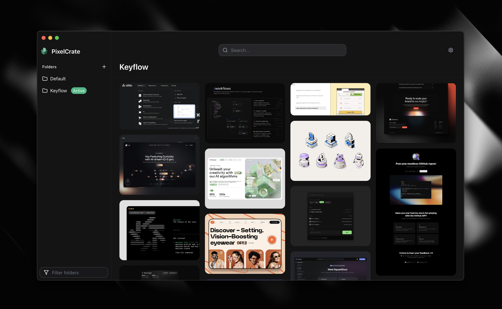

## Project info

PixelCrate is an open-source desktop app for collecting, organizing, and analyzing UI screenshots. It uses AI to automatically detect UI components and patterns, making it a powerful tool for designers and developers.



Kickstarted by [@gustavscirulis](https://github.com/gustavscirulis), built/upgraded by [@kushgabani](https://github.com/kushgabani)

## Features

- **Screenshot Management** – Collect and organize your UI screenshots in a visual grid layout
- **AI-Powered Pattern Detection** – Identify UI components and patterns using Gemini's 2.5 Flash Lite Model
- **Smart Organization** – Search and filter your screenshots based on detected UI elements
- **Fast Local Storage** – All screenshots and metadata are stored locally and can be synced with iCloud

## Installation

Download the latest release for your platform from the [releases](https://github.com/gustavscirulis/pixelcrate/releases) page.

### macOS Users
- If you have an Intel Mac (2020 or earlier), download `PixelCrate.dmg`
- If you have an Apple Silicon Mac (M1/M2/M3), download `PixelCrate-arm64.dmg`
- Not sure? Click Apple menu () > About This Mac. Under "Chip" or "Processor", you'll see which type you have

## Requirements

To use the AI pattern detection feature, you'll need to add your Gemini API key in the settings. The app uses GPT-4.1-mini for vision analysis. You can still use the app without this feature — it just won't detect patterns.

## Privacy

PixelCrate is built with privacy in mind:

- **Local-first by design**: All screenshots, metadata, and app data are stored locally on your device. Nothing is uploaded or stored remotely.
- **Optional AI analysis**: If enabled, screenshots are temporarily sent to Gemini's Vision API for pattern detection. This feature is optional and can be turned off at any time in the settings.
- **Anonymous usage analytics**: PixelCrate collects basic, anonymous usage stats and crash reports to help improve the app. No personal data or screenshots are ever collected. You can opt out of tracking in the settings.

## File storage

PixelCrate stores files in the following locations:

- **macOS**: `~/Documents/PixelCrate/`
- **Other platforms**: in the app's user data directory

Inside that folder:

- `images/` – All media files (PNG screenshots and MP4 videos)
- `metadata/` – JSON metadata for each media item
- `.trash/` – Deleted items are moved here (same structure as above)

## Development

PixelCrate is built with:

- Electron
- Vite
- TypeScript
- React
- shadcn-ui
- Tailwind CSS

### Setting Up Development Environment

```sh
# Clone the repository
git clone https://github.com/KushGabani/pixelcrate.git

# Navigate to the project directory
cd pixelcrate

# Install dependencies
npm install

# Start development server
npm run electron:dev
```

### Building for Production

```sh
# Build for production
npm run electron:build
```

## Contributing

Contributions are welcome! Please feel free to submit a Pull Request.

## License

This project is licensed under the GNU General Public License v3.0 (GPL-3.0) - see the LICENSE file for details. This license ensures that all modifications to this code remain open source.
